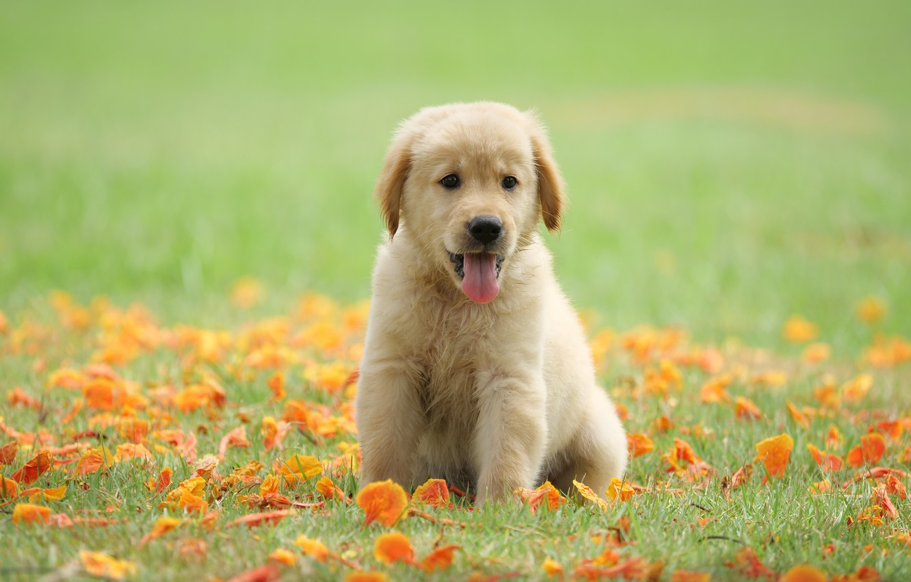

```{r setup, include=FALSE}
knitr::opts_chunk$set(echo = TRUE)
```


```{r, include=FALSE}
# you'll need to delete the eval=FALSE for this code chunk to execute
# but keep the include = FALSE so that it does not show up in the knit file (on the webpage)

library(tidyverse)
library(lubridate)
library(ical)

my_calendar <- ical_parse_df(file = "~/Dropbox (Personal)/git/calendar-project/Data_Science_Project.ics") %>%
  mutate(start_datetime = with_tz(start, tzone = "America/New_York")
    , end_datetime = with_tz(end, tzone = "America/New_York")
    , length_min = end_datetime - start_datetime
    , length_sec = length_min*60
    , length_hrs = length_min/60
    , date = floor_date(start_datetime, unit = "day")) %>%
  # modifying faulty data entries/inconsistencies
  select(summary, description, start_datetime, end_datetime, length_sec, length_min, length_hrs, date) %>%
  mutate(description = ifelse(description == '', NA, as.character(description))) %>%
  mutate(description = ifelse(description == '\nSchool', 'School', description)) %>%
  mutate(description = ifelse(description == 'Exercise\nFamily', 'Exercise Family', description)) %>%
  mutate(description = ifelse(summary == 'Dinner', 'Family', ifelse(summary == 'Sleep', 'Sleep', description))) %>%
  mutate(description = ifelse(is.na(description) & summary != "Cole's Birthday", 'School', description)) %>%
  mutate(description = ifelse(summary == "Walking", 'Exercise Family', description))
```

```{r, include=FALSE}
# start of data wrangling section

school_wrangled <- my_calendar %>%
  filter(description == 'School') %>%
  separate(summary, into=c('class', 'activity'), sep=': ', remove=FALSE) %>%
  mutate(activity = ifelse(class %in% c('Data Science', 'Evolutionary', 'Groups', 'Abnormal', 'Work'), activity, class)) %>%
  mutate(class = ifelse(class %in% c('Data Science', 'Evolutionary', 'Groups', 'Abnormal', 'Work'), class, NA)) %>%
  mutate(class = ifelse(activity == 'Fellows Meeting', 'Work', class))

#reorder columns for binding
school_wrangled <- school_wrangled[,c(10, 1, 2, 3:9)]

my_calendar1 <- my_calendar %>%
  mutate(class = NA, activity = NA) %>%
  filter(description != 'School')

# reorder columns for binding
my_calendar1 <- my_calendar1[,c(1, 9:10, 2:8)]

my_calendar_summary_modified <- my_calendar1 %>%
  rbind(school_wrangled)

unique(my_calendar_summary_modified$description)
```

# You can include section headers like this
## Or section subheaders like this
### How do I spend my time?

Motivation + primary questions of interest

blah blah blah

I can include an image (not created in R) like this:



Create a "img" folder within your calendar-project repo and store the image files there.

# Data collection

I collected data by . . . 

I can write a bulleted list like this:

- here's the first thing I want to say
- and I also want to say this
- lastly, this

And a numbered list like this:

1. First thing
2. Second thing
3. Third thing

# Results

And here are my results . . .

```{r}
# intersperse relevant figures and text
```
