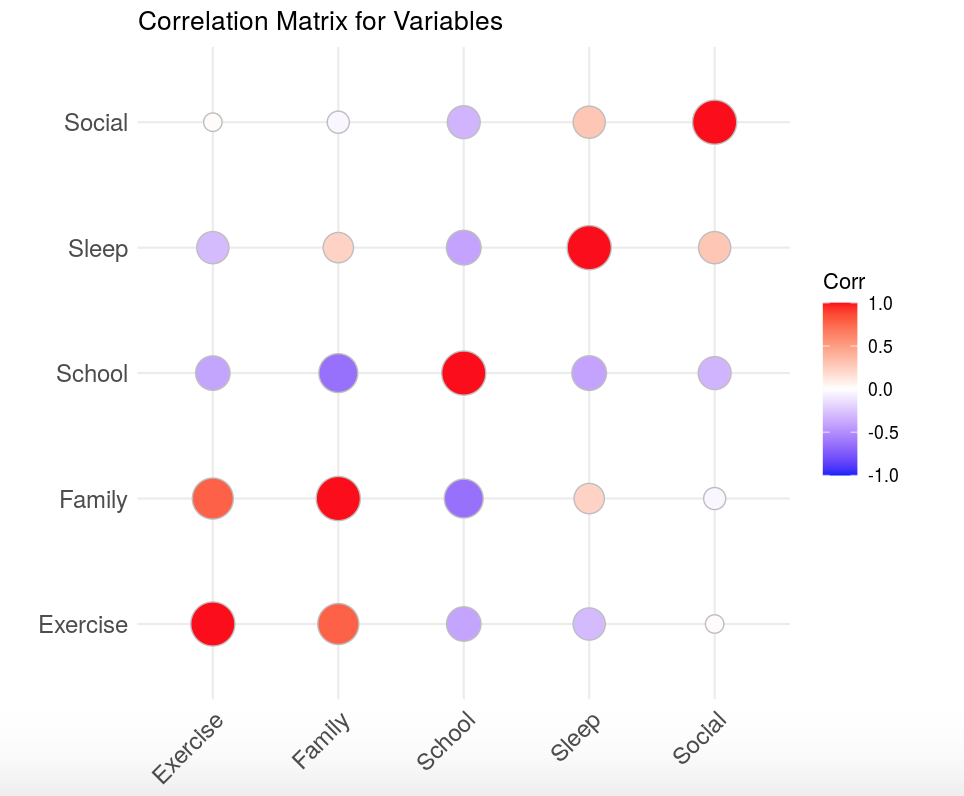

Purpose of this Website
=======================

COVID-19 was an extremely tumultuous time for everyone, with most people
experiencing disruptions to their daily lives and routines. I wanted to
quantify the difference in routine that I experienced while
transitioning from Amherst College to home. To best express this
difference, I have created an interactive Shiny app that displays how my
routine has changed and have analyzed the big trends that I noted.
Diagrams are interspersed throughout my analysis to highlight crucial
com

Motivating Questions
====================

My primary questions of interest were the following:

-   What classes did I spent the most time in during quarantine?
-   Is my productivity related to my sleep patterns and, if so, how?
-   What time of day am I the most productive? In other words, what time
    of day do I do the most work?
-   How has the total time spent across broad categories that define my
    daily routine (school, exercise, social, family) changed over time?
    How has the amount of time I spend in each class changed over time?
-   What is the distribution of the amount of time I spent in each
    category?

My hope was that I could glean some insights from this data about how I
structure my time when I am in a less structured environment (Amherst
College), where I had more explicitly scheduled activities and
priorities.

Data collection
---------------

I collected data by recording all of the activities that I did over the
course of two weeks. I made no intentions of doing these activities at
these particular times; data was entered retroactively since the primary
objective was to figure out how I structured my time with less explicit
structure to my routine.

I explicitly recorded my data into 5 unique classes:

1.  Data Science
2.  Evolutionary (Computation, a CS class I was taking at the time)
3.  Groups (Rings and Fields, ie Abstract Algebra)
4.  Abnormal (Psychology)
5.  Work (classified as any activity that was school-related but not
    under the particular umbrella of a class)

I also tracked each category’s “description” as one of the following:

1.  Sleep (was asleep)
2.  School (one of the five classes)
3.  Exercise
4.  Family
5.  Social (eg. Zoom meetings with friends, Netflix party, …)

I also included the particular activity that I was doing. I decided not
to include activities in my Shiny app simply because most activities had
unique identifiers (eg, Groups HW9 would be different from Groups Study
for Quiz). Therefore, it would be difficult to interactively look at how
I distributed my time by activity. In addition, I felt that analyzing
the time spent in my classes by specific activites was not the objective
of my research, providing additional incentive to not include activities
in my Shiny app. Analyzing how I spent time in my classes by activity,
however, is definitely a good next step for this project.

Each activity had a time stamp (beginning and ending time) and times
displayed in the graphs are recorded in **CST (Central Standard Time
Zone)**.

Results
=======

I made a Shiny app to display my results. Images relevant to the
analysis will be screenshotted and included here, but the link to access
the Shiny app is below. Git unfortunately does not allow for Shiny apps
to be embedded in-page, so please click the link here, [**Link to Shiny
app: Diary of a Wimpy
Bakshandeh**](https://michaelbakshandeh.shinyapps.io/calendar-project/)
to open the app.

Total Time spent in Classes over Time
-------------------------------------

The graph below is presented in my Shiny app, but the dodge histogram,
[**Distribution of Time Spent in Classes**](classes_bar_graph.html), is
reproduced at that link for ease of access.

I’ve also included the streamgraph, [**Evolution of Total Time Spent in
Classes- Streamgraph**](classes_streamgraph.html), for an alternative
visual.

From the streamgraph, it appears that the I do the most work on Mondays
and Tuesdays, and the amount of total work that I do decreases as the
week progresses. On Mondays and Tuesdays in particular, there appears to
be a spike in the amount of work I do in my “Work” class. This is likely
because I am a TA for Multivariable Calculus, so I am logging in “Work”
on these days that doesn’t exist on any other day.

Furthermore, as affirmed by the bar chart and the streamgraph, the class
that is the most “time consuming” for me is definitely Groups. There
appears to be spikes in the amount of work I do in Groups on Wednesdays
and Thursdays (for instance, on Wednesday April 8th I worked on Groups
for 4.5 hours). This is likely because we have weekly quizzes in Groups
on Thursdays and weekly homeworks due on Thursdays (at 10pm), so I spend
some time on Wednesday working through the concepts to prepare for the
quiz.

My other classes (Data Science, Evolutionary, and Abnromal) appear not
too time-consuming in comparison. There is a spike in the amount of work
I did in Evolutionary on Monday, April 13th, and there is also a spike
in the amount of work I did in Data Science one week later. Abnromal
overall appears to be the least time consuming, since it takes up the
least amount of area in the streamgraph.

Distribution of Categories
--------------------------

We will now look at the how total time spent on activities changed over
the course of my two weeks.

I have again included the link to the static summary containing all of
the categories here:

    ## Adding missing grouping variables: `description`, `date`

[Category Streamgraph](cat_streamgraph.html)

As expected, the total amount of time that I spent doing activities
remains relatively constant, but there is a noticable dip in the
weekend. This supports my theory that I am not nearly as productive
during the weekend as I am during the week.

The amount of time spent exercising appears to be relatively constant,
the amount of time that I spent doing schoolwork appears to be greater
in the full week that I was recording data, and the amount of sleep that
I had each night was also relatively constant.

This streamgraph provides evidence that I am productive on the weekends
while I am in quarantine. It would be interesting to see if this changes
once I am back at school.

Relationship between Sleep and School
-------------------------------------

The scatterplot for this one should be viewed interactively, so please
look at the Shiny app to see them under the tab that says “Productivity
vs. Sleep Patterns.”

The correlation matrix is displayed here:

In this correlation matrix, as the legend shows, white dots are
**insignificant** correlations, shaded blue dots are **negative**
correlations, and shaded red dots are **positive** correlations.

There is clearly a negative correlation between:

-   sleep and school (as amount of schoolwork increased, the amount of
    sleep I got decreased)

In addition, there is also a significant negative relationship between:

-   school and exercise (as the amount of schoolwork increased, the
    amount of exercise decreased)
-   family and school (as the amount of family time I spent increased,
    the amount of schoolwork I did decreased)

The amount of time I spent doing social activities was limited, so I am
not considering those correlations.

These correlations suggest that I was less productive on the days that I
slept more. To validate this claim, I have included the scatterplot that
strictly incorporates school and sleep. It is included below:

As the smoothed line shows, there is clearly an inverse relationship
between hours of sleep and total time spent on schoolwork. This
relationship could be due to going to bed later when I’m doing a lot of
schoolwork, or that I feel less motivated to do schoolwork when I am
sleeping more.

What Time of Day Am I Most Productive?
--------------------------------------

This graph should be viewed in the Shiny app under the “Amount of
Schoolwork Throughout the Day” tab, but an image has been included here
for illustrative purposes:

There is almost certainly a general pattern here that is immediately
apparent. For most days, there is a spike in the amount of work that I
am doing early in the day (around 10am EDT). The amount of work that I
am doing is steadily increasing until around 2pm EDT. Then, it appears
that the work I am doing is plateuing. Right around dinner time, the
amount of work done starts to increase again, but this time the work
increases at a slower rate. This suggests that my most productive time
is in the morning, and then I am slightly less productive in the
evening.

Distributions of Categories
---------------------------

I have included the [**Boxplot showing Distributions of
Categories**](boxplot.html) at that link. Similarly, I have shown the
[**Violin Plot showing Distributions of Categories**](violin.html) at
this link.

From the boxplot, we see that the distribution of sleep (a variable of
interest) is left-skewed, with a median time of 8.50. The shape of the
violin plot confirms that the distribution of the variable is
left-skewed.

On the other hand, we can see that the distribution of the total amount
of time spent doing schoolwork is left-skewed. The maximum amount of
time spent working on school was 11 hours, and the median amount of time
spent was 7.25 hours. The violin plot confirms that the distribution of
School is more symmetric than that of sleep, but still right skewed.

The distributions of Exercise, Family, and Social are all left skewed,
as evidenced from the boxplots. However, the range of these three
variables are all similar: the distributions range from 0 to around 4
(except for one point beyond the upper fence of the Family boxplot).

Reflection
==========

How Do I Structure my Time?
---------------------------

Overall, the findings about how I structure my time are not surprising.
I suspected that I spent the most time in Groups, and I suspected that I
was relatively inefficient in the middle of the day. Furthermore, the
distributions of the categories appear to make sense. I aim for 8 hours
of sleep a night, so the distribution should have a median value of
around 8, and the other distributions should centered around 1 or 2.

The most interesting discovery I made from this data analysis is that
the amount of time that I sleep is inversely related to the amount of
schoolwork that I do. As I mentioned, it would be interesting to see if
this is due to too much work, unproductiveness when I sleep for longer
than usual, or a combination of the two factors.

On the Process of Data Collection
---------------------------------

This process was the first time that I have ever both collected and
analyzed data. It is interesting to reflect on what I learned being on
both side of the data analysis process.

First, as some who provides data, I feel that our data should be
anonymized (ie, my name should not be given out with my data) whenever
it is given out. Furthermore, I would expect that any data that is being
collected on me is meant to explicitly benefit me in some way. For
instance, if a company is giving my data to an advertising agency, I
would expect that the ads would be more tailored to my interests as a
result. Similarly, for Google, I would expect that my searches (data I
am providing them) are being used to either improve the quality of my
top results for searches or to improve the quality of the suggested
search terms from Google.

On the other hand, as someone who analyzes other’s data, there is a
responsibility to make sure that you are presenting information
accurately and that you are presenting the information in an anonymized
way. It can often be temptimg to try and present the statistics a
certain way when, for instance, you are trying to appease a client.
However, it is more important to present your data accurately and
present what you have learned from it. Sometimes, not learning anything
new or presenting something that someone else wants to see is
interesting in its own matter.

For instance, in this project, I didn’t learn anything new about my
routine, even though I really hoped that this project would help me
learn something new about my routine. I could have tried to present the
data in a way that was interesting and revealed something interesting
about my routine. However, this would have been unethical to myself and
to everyone who views this webpage. It is a data scientist’s ethical
duty to ensure that the information that he is presenting is ethical and
anonymized.
